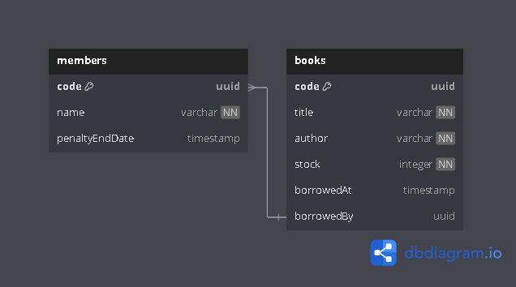

<p align="center">
  <a href="http://nestjs.com/" target="blank"></a>
</p>

[circleci-image]: https://img.shields.io/circleci/build/github/nestjs/nest/master?token=abc123def456
[circleci-url]: https://circleci.com/gh/nestjs/nest

  <p align="center">A progressive <a href="http://nodejs.org" target="_blank">Node.js</a> framework for building efficient and scalable server-side applications.</p>
    <p align="center">
<a href="https://www.npmjs.com/~nestjscore" target="_blank"></a>
<a href="https://www.npmjs.com/~nestjscore" target="_blank"></a>
<a href="https://www.npmjs.com/~nestjscore" target="_blank"></a>
<a href="https://circleci.com/gh/nestjs/nest" target="_blank"></a>
<a href="https://coveralls.io/github/nestjs/nest?branch=master" target="_blank"></a>
<a href="https://discord.gg/G7Qnnhy" target="_blank"></a>
<a href="https://opencollective.com/nest#backer" target="_blank"></a>
<a href="https://opencollective.com/nest#sponsor" target="_blank"></a>
  <a href="https://paypal.me/kamilmysliwiec" target="_blank"></a>
    <a href="https://opencollective.com/nest#sponsor"  target="_blank"></a>
  <a href="https://twitter.com/nestframework" target="_blank"></a>
</p>
  <!--[](https://opencollective.com/nest#backer)
  [](https://opencollective.com/nest#sponsor)-->

# ALGORITHM QUESTIONS
[Access this link](https://gist.github.com/Wordyka/d1e025ff3f8616b0cbaa9c7a58d37314).


# Simple Library Server

This project is a backend server implementation for a simple library system built with the [NestJS](https://github.com/nestjs/nest) framework using TypeScript. It follows Domain-Driven Design (DDD) principles and includes features like borrowing books, returning books, member and book management, and more. The API documentation is provided using Swagger, and the application uses a database for persistent storage.

## Project Description

This library system provides basic features for managing members, books, borrowing, and returning processes. It enforces rules for borrowing and penalizes late returns. Below are the main use cases:

- Members can borrow a maximum of 2 books at a time, as long as they are not already borrowed by another member and the member is not penalized.
- Members can return books they have borrowed, but a penalty is applied if the return is delayed by more than 7 days.
- Members and books can be checked and managed through the system, including displaying stock and borrowed book counts.

## Entity-Relationship Diagram (ERD)
[Access this link](https://dbdiagram.io/d/Simple-Library-Server-66f5398b3430cb846cb36378).


## Project Structure

```plaintext
src/
│
├── application/
│   ├── dto/
│   │   ├── borrow-book.dto.ts
│   │   └── return-book.dto.ts
│   ├── services/
│   │   ├── library.service.spec.ts
│   │   └── library.service.ts
│   ├── controllers/
│   │   ├── library.controller.ts
│   │   └── library.module.ts
│
├── domain/
│   ├── entities/
│   │   ├── book.entity.ts
│   │   └── member.entity.ts
│   └── repositories/
│
├── test/
│   ├── app.e2e-spec.ts
│   └── jest-e2e.json
│
├── main.ts
├── app.controller.ts
├── app.module.ts
└── app.service.ts

```

This project adheres to a Domain-Driven Design (DDD) structure, organizing the codebase into distinct layers:

- Application: Contains the DTOs, services, and controllers, implementing the business logic.
- Domain: Contains entities representing the core business objects (e.g., Book, Member) and repositories.
- Test: Contains unit and end-to-end tests for the application.

## Installation
To install the project dependencies, run the following command:
```
npm install
```

## Running the app
There are several modes in which you can run the application:
- Development mode:
```
npm run start
```
- Watch mode:
```
npm run start:dev
```
- Production mode:
```
npm run start:prod
```

## Test
You can run various tests to ensure the application's stability and reliability:
- Unit tests:
```
npm run test
```
- End-to-end (e2e) tests:
```
npm run test:e2e
```
- Test coverage:
```
npm run test:cov
```


# SmartFarm - Rice Plant Disease Detection

This project is a Java Android application that detects rice plant diseases and suggests solutions by scanning images using the GPT-4 API.

## Depedencies

```sh
implementation("com.github.Drjacky:ImagePicker:2.3.20")
implementation("com.squareup.retrofit2:retrofit:2.9.0")
implementation("com.squareup.retrofit2:converter-gson:2.9.0")
implementation("com.github.bumptech.glide:glide:4.11.0")
implementation("com.squareup.picasso:picasso:2.71828")
```